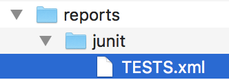
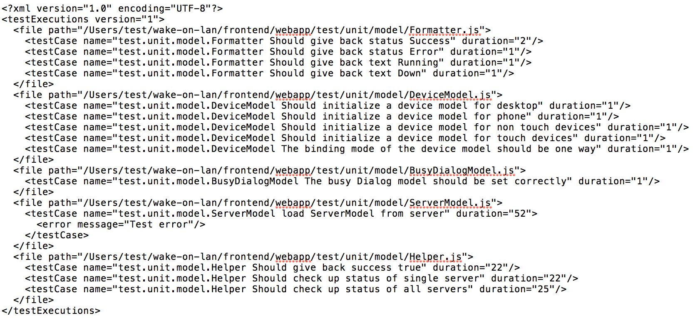
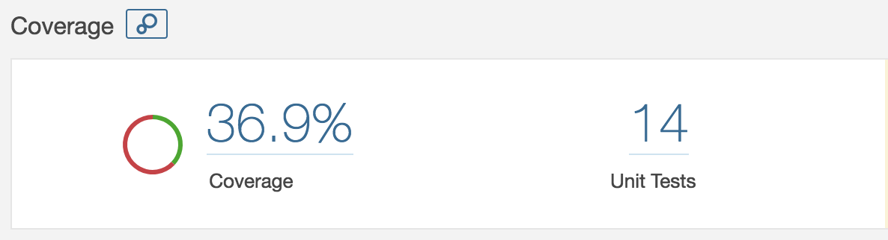
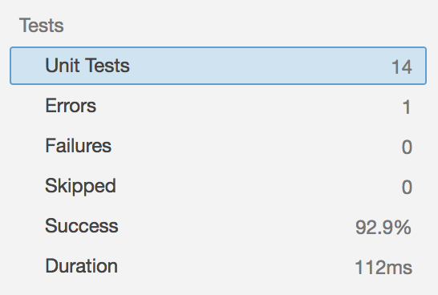
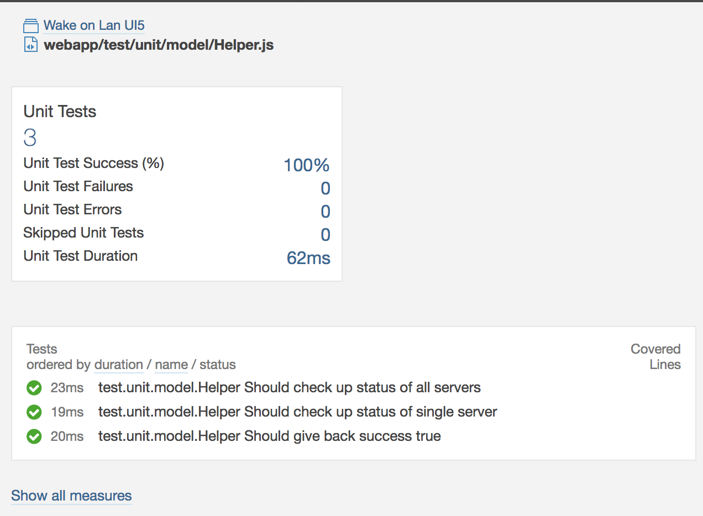
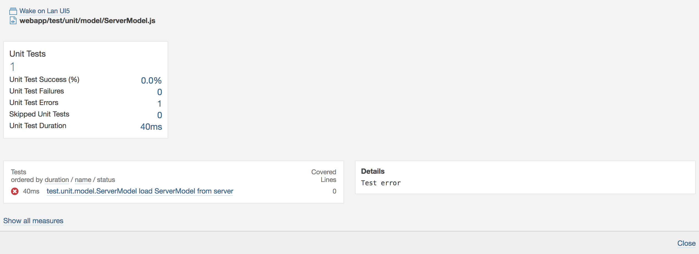

# karma-sonarqube-generic-reporter

> Reporter for the SonarQube Generic Test Data XML format.

Based on the original [karma-junit-reporter](https://github.com/karma-runner/karma-junit-reporter).

This version is adjusted to work with SonarQube 7.x and the [Generic Test Data importer](https://docs.sonarqube.org/display/SONAR/Generic+Test+Data) used by SQ to import unit tests.
 
## Installation

The easiest way is to keep `karma-sonarqube-generic-reporter` as a devDependency in your `package.json`. Just run

```bash
npm install --save-dev https://github.com/tobiashofmann/karma-junit-reporter#master 
```

to let npm automatically add it there. This adds the latest version of this code to your package.json:

"karma-junit-reporter": "https://github.com/tobiashofmann/karma-junit-reporter#master",

## Example package.json

```json
{
  "name": "test",
  "version": "0.0.1",
  "private": true,
  "devDependencies": {
    "karma": "^2.0.2",
    "karma-chrome-launcher": "^2.2.0",
    "karma-coverage": "^1.1.2",
    "karma-coverage-istanbul-reporter": "^2.0.1",
    "karma-qunit": "^1.2.1",
    "karma-sinon": "^1.0.5",
    "karma-sonarqube-generic-reporter": "https://github.com/tobiashofmann/karma-sonarqube-generic-reporter/#master",
    "qunitjs": "^2.0.0"
  },
  "main": "test.js",
  "scripts": {
    "test": "echo \"Error: no test specified\" && exit 1"
  },
  "author": "",
  "license": "MIT",
  "description": "",
  "dependencies": {}
}

```

## Configuration

The configuration is slightly different from the karma.junit.reporter as I removed some not needed parameters.

```js
// karma.conf.js
module.exports = function(config) {
  config.set({
    reporters: ['progress', 'junit'],

    // the default configuration
    junitReporter: {
      outputDir: '../reports/junit', // results will be saved as $outputDir/$browserName.xml
      outputFile: undefined, // if included, results will be saved as $outputDir/$browserName/$outputFile
      useBrowserName: false // add browser name to report and classes names
    },
    }
  });
};
```

# Example

To check whether the karma plugin is working I use my own Wake On Lan app written in OpenUI5. The source code is available on GitHub too: [wol-ui5](https://github.com/tobiashofmann/wol-ui5) The HTML app is in the folder frontend. After getting the source code, change to the folder and run npm install and then karma start.

```bash
git clone https://github.com/tobiashofmann/wol-ui5
cd wol-ui5
cd frontend
nom install
```

## Run karma

To generate the report file, run karma. The plugin will create an XML file in the specified location. For instance, at ./reports/junit. 



The content of the file will be scanned by SonarQube and must match their definition. An example XML file content generated by the plugin can be seen here:



This unit test result contains one failed test. Test ServerModel failed and contains a sub element named <error>.

## Upload report to SonarQube

For SonarQube to pick up and analyse the content of the report file, you need to inform the sonar scanner (or whatever tool you use) about the location of the XML file. To do so, edit the sonarqube.properties file.

```js 
# coverage reporting
sonar.testExecutionReportPaths=reports/junit/TESTS.xml
```

To upload the report, execute an analysis of the project. Using sonar-scanner:

```bash
sonar-scanner
```

Output:

```bash
INFO: Scanner configuration file: /users/dev/tools/sonar-scanner/conf/sonar-scanner.properties
INFO: SonarQube server 7.0.0
...
INFO: Sensor Generic Test Executions Report
WARN: Property 'sonar.genericcoverage.unitTestReportPaths' is deprecated. Please use 'sonar.testExecutionReportPaths' instead.
INFO: Parsing /Users/wake-on-lan/frontend/reports/junit/TESTS.xml
INFO: Imported test execution data for 5 files
INFO: Sensor Generic Test Executions Report (done) | time=76ms
...
INFO: Sensor SonarJS Coverage [javascript]
INFO: Analysing [/Users/wake-on-lan/frontend/reports/coverage/lcov.info]
INFO: Sensor SonarJS Coverage [javascript] (done) | time=12ms
...
INFO: Task total time: 12.664 s
INFO: ------------------------------------------------------------------------
INFO: EXECUTION SUCCESS
INFO: ------------------------------------------------------------------------
```

The scanner is pickung up hte TESTS.xml file from the specified location and imports the test data for all 5 test files. In case the location of the file specified in the XML report by <file path="path-to-unit-test/Test.js"> is invalid, sonar-scanner will show you the file not found.

## SonarQube

With the successfull import done, you can see the unit test results in SonarQube.



The unit tests are listed in the code measure section.



The test file contains additional information about the unit tests. For a successfull test:



In case of a not successfull unit test, SonarQube can show the additional information on the error as provided by the <error> element in the XML report.


